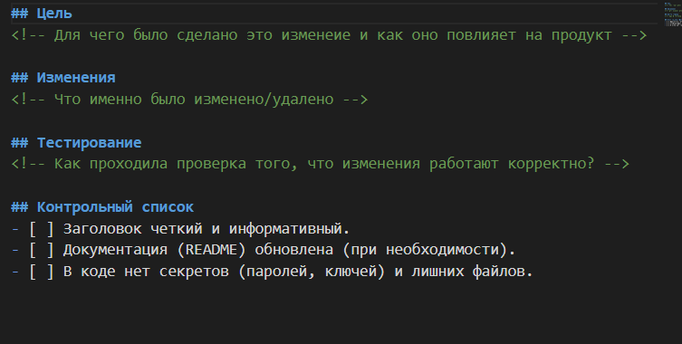
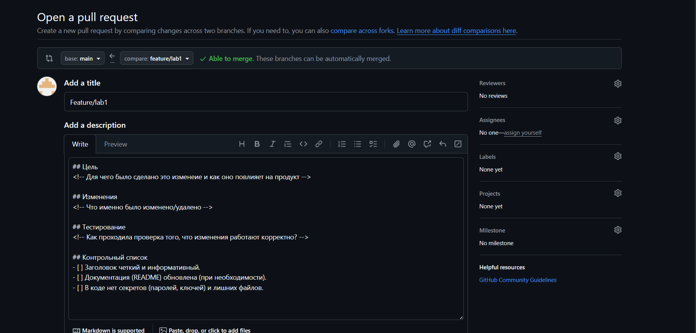
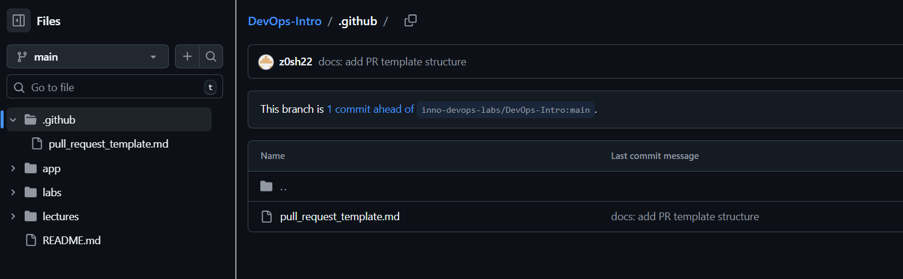

# Задание 1 Проверка подписи подтверждения SSH-соединения

## 1. Преимущества подписания коммитов
Подписание коммитов обеспечивает **аутентификацию** и **целостность** данных.
*   **Подтверждение авторства:** Гарантирует, что код написал именно владелец приватного ключа, а не злоумышленник, подставивший чужой `user.name` в настройки Git.
*   **Защита от подмены:** Любое изменение кода после подписания сделает подпись недействительной.

## 2. Почему подписание коммитов важно в DevOps?
В процессах DevOps и CI/CD автоматизация играет ключевую роль. Если pipeline автоматически берет код и отправляет его в продакшн, критически важно быть уверенным в источнике этого кода.
Подпись коммитов защищает от атак, когда хакеры внедряют вредоносный код в надежный репозиторий. Системы безопасности могут быть настроены так, чтобы отвергать любые изменения без валидной подписи.

## 3. Подтверждение
### Скриншот Verified статуса на GitHub
**

# Task 1 (English version)

## 1. Benefits of Signing Commits
Signing commits ensures both **authentication** and **data integrity**.
*   **Proof of Authorship:** It guarantees that the code was written by the owner of the private key, preventing malicious actors from spoofing the `user.name` or email.
*   **Tamper Protection:** It ensures that the commit data has not been altered by third parties after it was signed; any modification would invalidate the signature.

## 2. Why is Commit Signing Important in DevOps Workflows?
In DevOps and CI/CD pipelines, automation is key. Since automated systems deploy code to production without manual checks, verifying the source of the code is critical.
Commit signing protects against **Supply Chain Attacks**, where attackers might try to inject malicious code into a trusted repository. Security policies in CI/CD can be configured to automatically reject any changes that lack a valid signature, ensuring only verified code reaches production.

## 3. Just look at the screenshot in russian version

# Задание 2 Шаблон Pull Request

## Скриншот шаблона
**

Шаблон работает / template is workong
 

## Доказательство наличия файла
.

## Анализ пользы шаблонов
Использование шаблонов для PR значительно улучшает сотрудничество, так как:
1. **Стандартизация:** Все разработчики оформляют описание одинаково.
2. **Напоминание:** Чек-лист не дает забыть про важные вещи (тесты, документация).
3. **Экономия времени:** Не нужно каждый раз придумывать структуру описания с нуля.

# Task 2 English version

## for paragraph 1 and task 2 loot at screenshots 

## 3. Analysis: How PR Templates Improve Collaboration
Using Pull Request templates significantly enhances team collaboration by:
1. **Standardization:** It ensures all developers follow a consistent format for descriptions, making it easier for reviewers to understand the context.
2. **Compliance & Quality:** The checklist serves as a mandatory reminder for critical steps (e.g., running tests, updating documentation), reducing the chance of human error.
3. **Efficiency:** It saves time by providing a ready-to-use structure, eliminating the need to write descriptions from scratch for every change.

